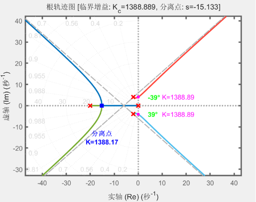

# 根轨迹分析工具 (Root Locus Analysis Tool)
基于 MATLAB 的根轨迹分析工具，**专为 s 右半平面无开环零极点的SISO系统设计**，相比原生 `rlocus` 函数提供更丰富的分析能力和可视化效果。

非常适合用来做作业 😀😀😀

## 🚀 核心功能
- 基础分析：根轨迹绘制、临界增益自动求解、分离点/汇合点定位、渐近线计算与绘制、出射角/入射角计算
- 增强分析：零极点与实轴夹角计算、复数零极点间角度/距离分析、实轴根轨迹区段识别、图形关键点精准标注、详细参数控制台输出

## 📁 文件说明
### 1. `plotRootLocus.m`（主函数）
**函数原型**
```matlab
[r, k, k_critical, asymptotes, angles] = plotRootLocus(sys, kin)
```
| 参数类型 | 参数名          | 说明                |
|----------|--------------|-------------------|
| 输入 | `sys`        | 开环传递函数（tf/zpk 对象） |
| 输入 | `kin`        | 开环传递函数增益          |
| 输出 | `r`          | 根轨迹极点位置矩阵         |
| 输出 | `k`          | 对应增益向量            |
| 输出 | `k_critical` | 虚轴交点临界增益数组        |
| 输出 | `asymptotes` | 渐近线信息（中心/角度/数量）   |
| 输出 | `angles`     | 出射角/入射角信息         |

### 2. `sys.m`（自定义系统）
用于输入待分析的开环传递函数，**仅支持 s 右半平面无零极点的系统**，支持零极点/直接传递函数两种定义方式。

## ⚙️ 快速使用
### 步骤1：定义系统模型
修改 `sys.m`，任选一种方式定义传递函数：
```matlab
% 方式1：零极点定义
sys_zeros = [];                    % 零点
sys_poles = [0 -20 -2-4i -2+4i];  % 极点
sys_gain = 1;                      % 增益
G = zpk(sys_zeros, sys_poles, sys_gain);

% 方式2：直接定义
s = tf('s');
G = 1 / (s * (s + 20) * (s^2 + 4*s + 20));
```
❗❗**注意：使用 `zpk()` 生成的传递函数为首 1 标准型，若待分析系统传递函数非首 1 标准型，请自行化简或使用其他方法。**

### 步骤2：运行分析
```matlab
>> sys
```

### 步骤3：查看结果
- 图形：自动绘制带标注的根轨迹图
- 控制台：输出零极点、临界增益、分离点等全量分析数据
- 返回值：可调用输出参数做二次分析

## 📝 输出说明
### 图形标注
| 图形元素  | 含义 |
|-------|------|
| 红色 ×  | 系统极点 |
| 红色 ○  | 系统零点 |
| 品红色 ● | 虚轴交点（临界稳定点） |
| 蓝色 ■  | 分离点/汇合点 |
| 灰色虚线  | 渐近线 |

### 绘制结果


### 控制台输出(核心输出)
```
=== 零极点与实轴夹角 ===
极点 3: -2.0000+4.0000j，夹角 = 116.6°
极点 4: -2.0000-4.0000j，夹角 = -116.6°

=== 临界增益计算 ===
虚轴交点: s = ±4.0825j, 临界增益: K = 1388.8889

=== 分离点计算 ===
分离点：s = -15.1326, K = 13881.6701

=== 渐近线计算 ===
中心: σ = -6.0000，角度: 45.0°/135.0°/225.0°/315.0°

=== 出射角计算 ===
极点 -2.0000+4.0000j: 出射角 = -39.1°
```

## 💻 环境要求
- MATLAB R2016b+
- **依赖工具箱：Control System Toolbox、Symbolic Math Toolbox**

## ⚠️ 重要限制与注意事项
1. **核心限制**：**仅支持 s 右半平面无开环零极点的单输入单输出（SISO）系统**，含右半平面零极点的系统无法正确分析
4. 无法同时分析多个系统的根轨迹
5. 高阶系统计算可能耗时较长
5. 计算结果存在微小误差

## 📄 许可证
MIT 许可证

---
**作者**: UKON09 | **更新日期**: 2026年6月 | **版本**: 1.2